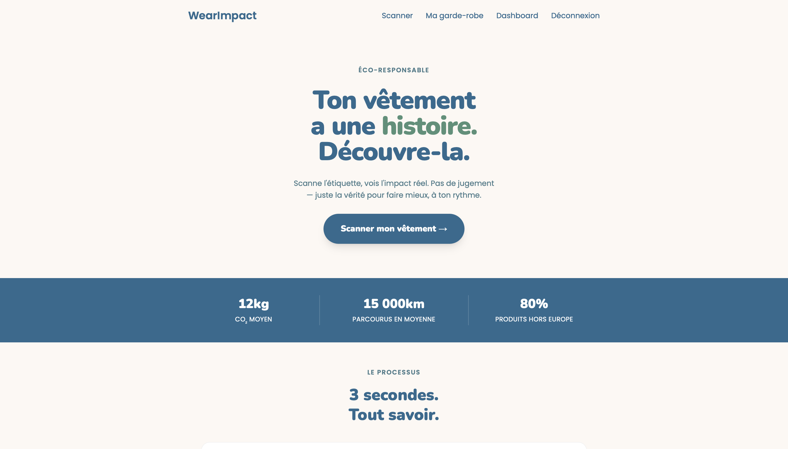
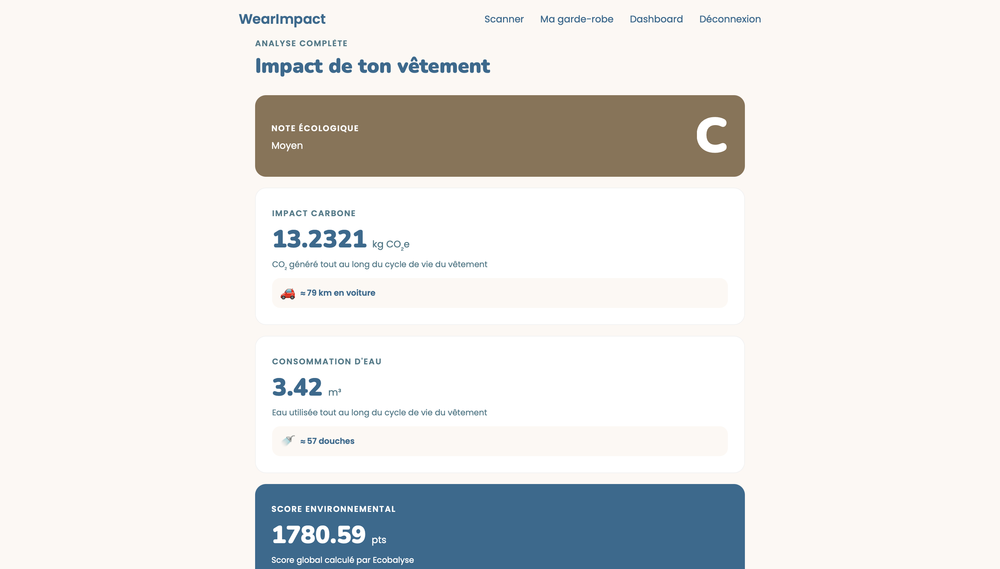
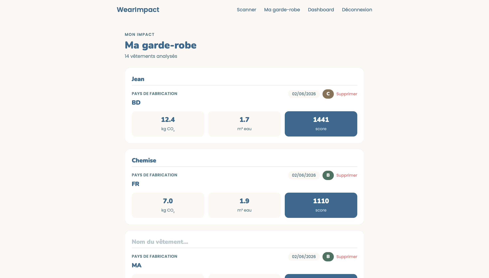
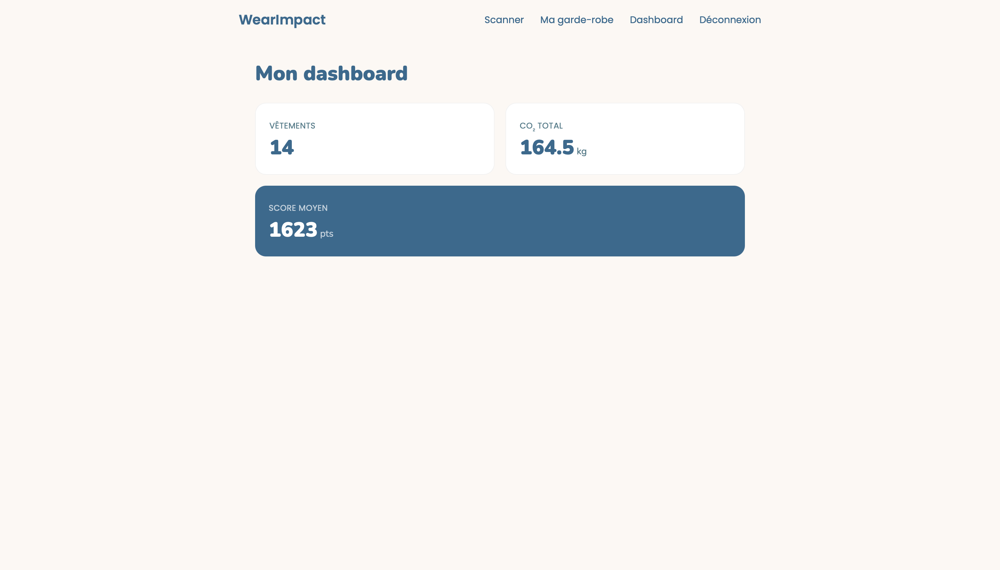

# WearImpact 🌿

> **L'impact de tes vêtements, enfin visible.**

[](https://github.com/CH-Hugo/wearimpact/actions/workflows/ci.yml)
[](https://wearimpact.vercel.app)

---

## 🌍 C'est quoi ?

WearImpact permet à n'importe qui de **scanner l'étiquette d'un vêtement** et de voir son impact écologique réel en quelques secondes — CO₂, consommation d'eau, score de A à E.

Les données viennent directement de l'**API Ecobalyse**, l'outil officiel du gouvernement français. Je ne calcule rien moi-même, je délègue à une source scientifique validée.

---

## 🎯 Pour qui ?

| Persona | Profil | Usage |
|---|---|---|
| **Thomas** | Étudiant, 21 ans, budget serré | Scanne en magasin avant d'acheter |
| **Sarah** | Jeune active, 32 ans | Suit l'impact de toute sa garde-robe |
| **Charlotte** | Influenceuse éco, 28 ans | Recommande l'outil à sa communauté |

---

## ✨ Fonctionnalités

- **Scan OCR** — reconnaissance automatique de l'étiquette via Tesseract.js (in-browser, la photo ne quitte jamais l'appareil)
- **Saisie manuelle** — formulaire multi-matières avec listes dynamiques Ecobalyse, pré-rempli après un scan
- **Score A à E** — calculé sur le cycle de vie complet (production, transport, utilisation, fin de vie)
- **Équivalences concrètes** — "12 kg CO₂ = 80 km en voiture", "17 litres d'eau = X douches"
- **Garde-robe numérique** — sauvegarde, nommage, suppression des vêtements scannés
- **Dashboard** — CO₂ total, score moyen, nombre de vêtements analysés
- **Authentification complète** — inscription, connexion, protection des routes

---

## 🖥️ Démo

> **Application en production : [wearimpact.vercel.app](https://wearimpact.vercel.app)**

### Page d'accueil


### Résultat d'un scan


### Garde-robe


### Dashboard


---

## 🛠️ Stack technique

| Technologie | Pourquoi ce choix |
|---|---|
| **Next.js 16** | React pour le front + Node.js pour le back dans un seul projet, un seul langage |
| **MongoDB Atlas Paris** | Données JSON flexibles, cohérent avec JavaScript. Région Paris certifiée low carbon |
| **API Ecobalyse** | Données officielles du gouvernement français. Méthodologie scientifique validée par l'ADEME |
| **Tesseract.js** | OCR open source qui tourne dans le navigateur, la photo ne quitte pas l'appareil |
| **Vercel** | Déploiement continu automatique à chaque push sur `main` |
| **GitHub Actions** | CI/CD — lint + build + tests Playwright à chaque push |

---

## 🚀 Installation locale

### Prérequis
- Node.js
- Un compte [MongoDB Atlas](https://www.mongodb.com/atlas) (cluster gratuit suffisant)
- Un token [API Ecobalyse](https://ecobalyse.beta.gouv.fr/#/auth)

### Étapes

```bash
# 1. Cloner le repo
git clone https://github.com/CH-Hugo/wearimpact.git
cd wearimpact

# 2. Installer les dépendances
npm install

# 3. Configurer les variables d'environnement
cp .env.example .env.local
# Remplir .env.local avec tes valeurs

# 4. Lancer le serveur de développement
npm run dev
```

### Variables d'environnement

Créer un fichier `.env.local` à la racine :

```env
MONGODB_URI=mongodb+srv://...
ECOBALYSE_API_TOKEN=ton_token_ici
JWT_SECRET=une_chaine_aleatoire_longue
```

---

## 📁 Architecture

```
wearimpact/
├── src/
│   ├── middleware.js           # Protection serveur des routes /garde-robe, /dashboard
│   ├── app/                    # Pages et API Routes 
│   │   ├── api/
│   │   │   ├── auth/           # Inscription et connexion
│   │   │   ├── impact/         # Calcul Ecobalyse
│   │   │   ├── materiaux/      # Liste des matières 
│   │   │   ├── pays/           # Liste des pays 
│   │   │   └── vetements/      
│   │   ├── connexion/
│   │   ├── dashboard/
│   │   ├── garde-robe/
│   │   ├── inscription/
│   │   ├── resultat/
│   │   ├── saisie-manuelle/
│   │   ├── scan/               # parseEtiquette() : parsing OCR → matières + pays
│   │   ├── layout.js           
│   │   └── page.js             # Page d'accueil
│   ├── components/
│   │   └── Navbar.js           # Navbar responsive avec état auth
│   └── lib/
│       ├── auth.js             # Helper verifierToken centralisé
│       ├── deconnexion.js      # Logique de déconnexion partagée
│       ├── mongodb.js          # Connexion MongoDB avec index
│       └── score.js            # Fonction getScore → A-E
├── tests/
│   ├── auth.spec.js            # Tests inscription/connexion
│   └── saisieManuelle.spec.js  # Tests saisie manuelle
├── .github/
│   └── workflows/
│       ├── ci.yml              # Lint + build + Playwright + artifact
│       └── sonarqube.yml       # Analyse SonarCloud
├── playwright.config.js
└── sonar-project.properties
```

---

## ✅ Qualité & NFR

### Tests automatisés
```bash
npm test          # Lance les 8 tests Playwright
npm run lint      # ESLint
npm run build     # Build de production
```

8 tests end-to-end Playwright couvrent les flux critiques :
- Authentification (inscription, connexion, liens croisés)
- Saisie manuelle (chargement, sélecteur, validation pourcentage)

### Accessibilité RGAA
- Skip link en haut de chaque page
- `aria-label` sur tous les boutons sans texte visible
- Navigation clavier complète (menu hamburger fermable avec Escape)
- HTML sémantique — `<main>`, `<nav>`, `<header>`, `<form>`
- Contrastes vérifiés

### Numérique responsable
- MongoDB Atlas hébergé à Paris
- Polices chargées via `next/font` 
- Cache serveur 1h sur les listes Ecobalyse 
- Badge Ecoindex en footer
- Tesseract.js chargé dynamiquement 

### Sécurité
- Mots de passe hashés avec bcrypt (salt 10)
- Tokens JWT signés avec secret en variable d'environnement
- Middleware d'authentification sur les routes protégées
- Pas d'énumération d'utilisateurs sur le login
- Validation `ObjectId.isValid()` avant chaque requête MongoDB
- Toutes les variables sensibles dans `.env.local` (jamais commitées)

### Pipeline CI/CD
À chaque push sur `main` :
1. ESLint — vérification du style de code
2. Build Next.js — vérification de la compilation
3. Tests Playwright — 8 tests end-to-end
4. Upload du rapport HTML (artifact GitHub Actions)
5. Analyse SonarCloud — qualité et sécurité du code
6. Déploiement automatique sur Vercel

---

## 🗺️ Roadmap

- [ ] Tests automatisés plus couvrants
- [ ] Amélioration OCR — résolution et prétraitement image

---

## 👤 Auteur

**Hugo Chabod** — Étudiant Développeur Fullstack.

- 🌐 [wearimpact.vercel.app](https://wearimpact.vercel.app)
- 💻 [github.com/CH-Hugo](https://github.com/CH-Hugo)

---

*Projet de fin d'année B1 — Coda Dijon — Juin 2026*
